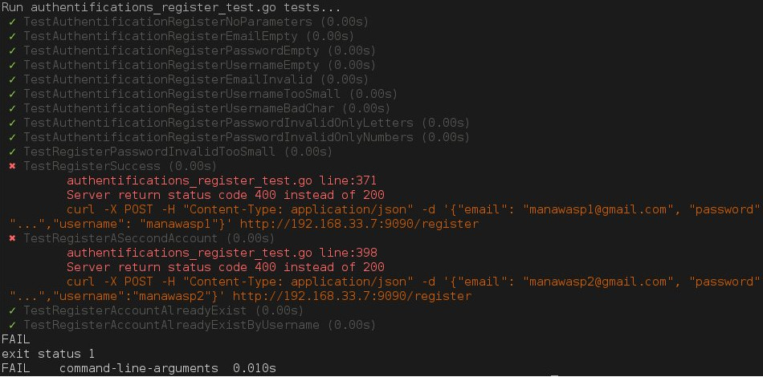

Gotest Beautify
=======

Gotest Beautify is a simple and very short script who parse `go test` output and make it more readable written in bash. (~35 lines of code)

Keywords: `Golang` `Test` `Bash`

How to use it
=======

```shell
$ ls
auths_register_test.go auths_logout_test.go
$ go test -v auths_register_test.go auths_logout_test.go
...
# With beautify
$ ./beautify.sh auths_register_test.go auths_login_test.go
...
# You can easily create 'module', just look inside of beautify
$ ./beautify.sh auths
...
```


Output example
=======

**beautify**


You can find [here](./examples/go-test.jpg) an example without beautify test to compare.

## TODO

- [ ] - Find a solution panic in test are print in the beginning
- [ ] - Add a state value to stop to use coloration trick when log are printed
- [ ] - Count test result and draw them (total, fail, success, skipped)

## Contributing

Feel free to fork and contribute to the repository, any PR is **welcome**.

## Why this code snippet ?

At [Ognitio](https://www.ognitio.com/), as we've wrote a lot of tests using `go test`, we've encountered a problem : print are not very friendly. We've spent time to try to read them as we wanted to limit external dependencies. So, as a big fan of [mocha.js](https://mochajs.org/), I added some bash filter with sed to make the output beautiful.   

**[@Manawasp](https://github.com/Manawasp) - Clovis Kyndt**
